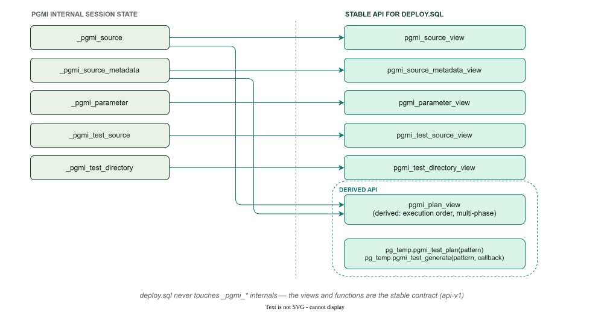
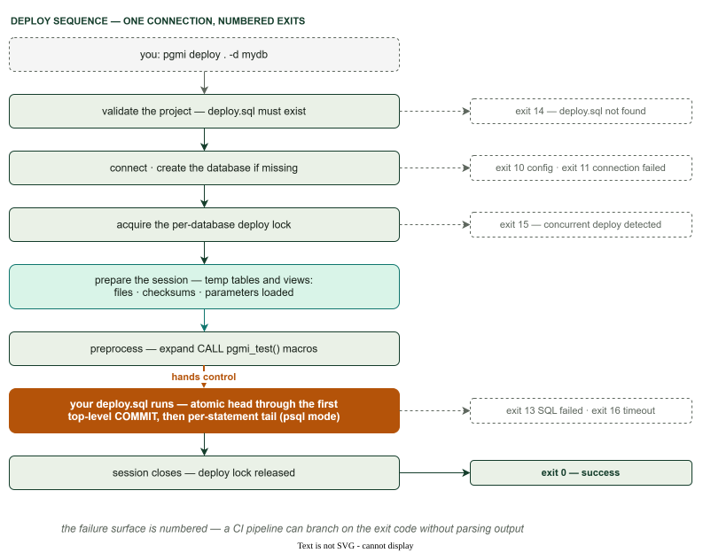

# deploy.sql Authoring Guide

This guide covers patterns for writing `deploy.sql` — from basic file execution to data ingestion, environment branching, and multi-phase deployments. Every example is copy-paste ready.

For the session API reference (views, columns, functions), see [Session API](session-api.md).



The whole deployment is one connection with a numbered failure surface:



---

## What gets loaded

pgmi loads **every file** under the project path into the session — not just
SQL. Use `is_sql_file` in `pgmi_source_view` to filter, or read a `.json`,
`.csv` or `.xml` file as data (see the loading recipes below).

Four things are excluded:

| Excluded | Why |
|---|---|
| The root `deploy.sql` | pgmi executes it; it never appears in `pgmi_source_view`. Nested ones (`examples/deploy.sql`) load normally. |
| `__test__/` and `__tests__/` | Loaded into `pgmi_test_source_view` instead, so a deployment loop can never execute a test file by accident. |
| Hidden files and directories (any name starting with `.`) | `.git`, `.venv`, `.idea`, `.env` — tooling and secrets, not project content. |
| `node_modules/` and `__pycache__/` | Dependency and build caches. |

Everything else is read as **text**. A binary file inside the project path
(and outside the exclusions above) fails the deploy before any connection is
made, naming the file — move it out of the project path or into a hidden
directory.

Discovery decides what enters the session; it never decides what runs. Your
`deploy.sql` still selects and orders everything it executes.

---

## The basic pattern

Your `deploy.sql` queries files from session views and executes them with `EXECUTE`:

```sql
BEGIN;

DO $$
DECLARE v_file RECORD;
BEGIN
    FOR v_file IN (
        SELECT path, content
        FROM pg_temp.pgmi_source_view
        WHERE directory = './migrations/' AND is_sql_file
        ORDER BY path
    ) LOOP
        RAISE NOTICE 'Executing: %', v_file.path;
        EXECUTE v_file.content;
    END LOOP;
END $$;

COMMIT;
```

Use `pgmi_plan_view` instead of `pgmi_source_view` when you want metadata-driven ordering via `<pgmi-meta>` blocks. See [Session API](session-api.md#which-view-should-i-use).

---

## Environment branching

Use `current_setting('pgmi.env', true)` to branch deployment logic by environment:

```sql
DO $$
DECLARE
    v_env TEXT := COALESCE(current_setting('pgmi.env', true), 'development');
    v_file RECORD;
BEGIN
    IF v_env = 'development' THEN
        EXECUTE 'DROP SCHEMA IF EXISTS app CASCADE';
        EXECUTE 'CREATE SCHEMA app';
    END IF;

    FOR v_file IN (
        SELECT path, content FROM pg_temp.pgmi_source_view
        WHERE directory = './migrations/' AND is_sql_file
        ORDER BY path
    ) LOOP
        EXECUTE v_file.content;
    END LOOP;

    IF v_env = 'production' THEN
        INSERT INTO audit.deployments (deployed_at, env) VALUES (now(), v_env);
    END IF;
END $$;
```

```bash
pgmi deploy . -d myapp --param env=production
```

---

## Error context with exception blocks

Wrap each file execution in an exception block to see which file failed:

```sql
DO $$
DECLARE v_file RECORD;
BEGIN
    FOR v_file IN (
        SELECT p.path, p.content
        FROM pg_temp.pgmi_plan_view p
        JOIN pg_temp.pgmi_source_view s ON s.path = p.path
        WHERE s.is_sql_file
        ORDER BY p.execution_order
    ) LOOP
        RAISE NOTICE 'Executing: %', v_file.path;
        BEGIN
            EXECUTE v_file.content;
        EXCEPTION WHEN OTHERS THEN
            RAISE EXCEPTION 'Failed on %: %', v_file.path, SQLERRM;
        END;
    END LOOP;
END $$;
```

The transaction still rolls back entirely on failure — the exception block is for diagnostics, not partial commits.

---

## Idempotent migrations with tracking

Track which files have run to avoid re-executing non-idempotent migrations:

```sql
CREATE TABLE IF NOT EXISTS migration_log (
    path TEXT PRIMARY KEY,
    checksum TEXT NOT NULL,
    executed_at TIMESTAMPTZ DEFAULT now()
);

DO $$
DECLARE v_file RECORD;
BEGIN
    FOR v_file IN (
        SELECT path, content, checksum
        FROM pg_temp.pgmi_source_view
        WHERE directory = './migrations/' AND is_sql_file
        ORDER BY path
    ) LOOP
        IF EXISTS (
            SELECT 1 FROM migration_log
            WHERE path = v_file.path AND checksum = v_file.checksum
        ) THEN
            RAISE NOTICE 'Skipping (unchanged): %', v_file.path;
            CONTINUE;
        END IF;

        EXECUTE v_file.content;

        INSERT INTO migration_log (path, checksum)
        VALUES (v_file.path, v_file.checksum)
        ON CONFLICT (path) DO UPDATE
            SET checksum = EXCLUDED.checksum, executed_at = now();
    END LOOP;
END $$;
```

`pgmi_source_view` carries two checksums: `checksum` (raw SHA-256) and `pgmi_checksum` (normalized — comments stripped, case-folded, whitespace collapsed). Track against whichever fits — see [Checksum-based change detection](#checksum-based-change-detection).

---

## Loading JSON configuration

pgmi loads **all** project files — not just SQL. Use `pgmi_source_view` to read JSON, XML, CSV, or any text file.

Given `./config/app.json`:
```json
{
  "feature_flags": {
    "dark_mode": true,
    "beta_features": false
  },
  "rate_limits": {
    "api_requests_per_minute": 100
  }
}
```

```sql
DO $$
DECLARE
    v_config JSONB;
    v_file RECORD;
BEGIN
    CREATE TABLE IF NOT EXISTS app_config (
        key TEXT PRIMARY KEY,
        value JSONB NOT NULL,
        updated_at TIMESTAMPTZ DEFAULT now()
    );

    FOR v_file IN (
        SELECT content FROM pg_temp.pgmi_source_view
        WHERE path = './config/app.json'
    ) LOOP
        v_config := v_file.content::jsonb;

        INSERT INTO app_config (key, value)
        SELECT key, value FROM jsonb_each(v_config)
        ON CONFLICT (key) DO UPDATE
            SET value = EXCLUDED.value, updated_at = now();
    END LOOP;
END $$;
```

### Loading environment-specific config

```sql
DO $$
DECLARE
    v_env TEXT := COALESCE(current_setting('pgmi.env', true), 'development');
    v_file RECORD;
    v_config JSONB;
BEGIN
    FOR v_file IN (
        SELECT content FROM pg_temp.pgmi_source_view
        WHERE path = './config/' || v_env || '.json'
    ) LOOP
        v_config := v_file.content::jsonb;

        INSERT INTO app_config (key, value, environment)
        SELECT key, value, v_env FROM jsonb_each(v_config)
        ON CONFLICT (key, environment) DO UPDATE
            SET value = EXCLUDED.value, updated_at = now();
    END LOOP;
END $$;
```

---

## Loading XML reference data

Given `./data/currencies.xml`:
```xml
<currencies>
    <currency code="USD" name="US Dollar" symbol="$" decimals="2"/>
    <currency code="EUR" name="Euro" symbol="€" decimals="2"/>
    <currency code="JPY" name="Japanese Yen" symbol="¥" decimals="0"/>
</currencies>
```

```sql
DO $$
DECLARE
    v_xml XML;
    v_file RECORD;
BEGIN
    FOR v_file IN (
        SELECT content FROM pg_temp.pgmi_source_view
        WHERE path = './data/currencies.xml'
    ) LOOP
        v_xml := v_file.content::xml;

        INSERT INTO currency (code, name, symbol, decimal_places)
        SELECT
            (xpath('@code', x))[1]::text,
            (xpath('@name', x))[1]::text,
            (xpath('@symbol', x))[1]::text,
            ((xpath('@decimals', x))[1]::text)::int
        FROM unnest(xpath('/currencies/currency', v_xml)) AS x
        ON CONFLICT (code) DO UPDATE
            SET name = EXCLUDED.name,
                symbol = EXCLUDED.symbol,
                decimal_places = EXCLUDED.decimal_places;
    END LOOP;
END $$;
```

---

## Loading CSV data

For simple CSV files without quoting or escaping:

```sql
DO $$
DECLARE
    v_file RECORD;
    v_lines TEXT[];
    v_line TEXT;
    v_fields TEXT[];
    v_row_num INT := 0;
BEGIN
    FOR v_file IN (
        SELECT content FROM pg_temp.pgmi_source_view
        WHERE path = './data/countries.csv'
    ) LOOP
        v_lines := string_to_array(v_file.content, E'\n');

        FOREACH v_line IN ARRAY v_lines LOOP
            v_row_num := v_row_num + 1;
            IF v_row_num = 1 THEN CONTINUE; END IF;
            IF v_line = '' THEN CONTINUE; END IF;

            v_fields := string_to_array(v_line, ',');

            INSERT INTO country (code, name)
            VALUES (v_fields[1], v_fields[2])
            ON CONFLICT DO NOTHING;
        END LOOP;
    END LOOP;
END $$;
```

For large or complex CSV files (quoted fields, escaping), use PostgreSQL's `COPY` command with an external file instead. PL/pgSQL string splitting is adequate for reference data (hundreds to low thousands of rows), not bulk imports.

---

## Checksum-based change detection

Skip files that haven't changed since the last deployment. This example tracks
`pgmi_checksum` (the normalized checksum — comments stripped, case-folded,
whitespace collapsed) so that reformatting or adding comments won't force a
re-load. Swap to `checksum` if you need byte-exact change detection.

> **Column name warning:** `pgmi_source_view.checksum` is the raw SHA-256;
> `pgmi_plan_view.checksum` is the normalized one. Same column name, different
> value. See [Session API — Two checksums](session-api.md#two-checksums-and-which-to-track-against).

```sql
CREATE TABLE IF NOT EXISTS loaded_data_file (
    path TEXT PRIMARY KEY,
    checksum TEXT NOT NULL,
    loaded_at TIMESTAMPTZ DEFAULT now()
);

DO $$
DECLARE v_file RECORD;
BEGIN
    FOR v_file IN (
        SELECT path, content, pgmi_checksum
        FROM pg_temp.pgmi_source_view
        WHERE directory = './data/' AND extension = '.json'
    ) LOOP
        IF EXISTS (
            SELECT 1 FROM loaded_data_file
            WHERE path = v_file.path AND checksum = v_file.pgmi_checksum
        ) THEN
            RAISE NOTICE 'Skipping (unchanged): %', v_file.path;
            CONTINUE;
        END IF;

        -- Process file content here

        INSERT INTO loaded_data_file (path, checksum)
        VALUES (v_file.path, v_file.pgmi_checksum)
        ON CONFLICT (path) DO UPDATE
            SET checksum = EXCLUDED.checksum, loaded_at = now();
    END LOOP;
END $$;
```

---

## Multi-phase deployment

Separate transactional and non-transactional work into distinct phases:

```sql
-- Phase 1: Schema changes (transactional)
BEGIN;

DO $$
DECLARE v_file RECORD;
BEGIN
    FOR v_file IN (
        SELECT path, content FROM pg_temp.pgmi_source_view
        WHERE directory = './migrations/' AND is_sql_file
        ORDER BY path
    ) LOOP
        RAISE NOTICE 'Executing: %', v_file.path;
        EXECUTE v_file.content;
    END LOOP;
END $$;

COMMIT;

-- Phase 2: Non-transactional operations
DO $$
DECLARE v_file RECORD;
BEGIN
    FOR v_file IN (
        SELECT path, content FROM pg_temp.pgmi_source_view
        WHERE directory = './post-deploy/' AND is_sql_file
        ORDER BY path
    ) LOOP
        RAISE NOTICE 'Post-deploy: %', v_file.path;
        EXECUTE v_file.content;
    END LOOP;
END $$;
```

---

## Atomic mode, then psql mode: the execution contract

The whole contract in one sentence: **before your first top-level `COMMIT`,
pgmi's atomic mode; after it, psql mode.**

pgmi executes deploy.sql on one connection as follows:

- **Head (atomic mode).** Everything up to and including the *first* top-level
  transaction terminator — `COMMIT` (or its synonyms `END`, `COMMIT WORK`,
  `COMMIT TRANSACTION`), a top-level `ROLLBACK`, or their `AND CHAIN`
  variants, and `ABORT` — is sent as one unit and runs as a single
  transaction. A deploy.sql with **no** top-level terminator is entirely
  atomic: one transaction, all-or-nothing.
- **Tail (psql mode).** Every top-level statement after that terminator runs
  as its own statement, exactly as if you pasted the script into psql:
  per-statement autocommit, and an explicit `BEGIN ... COMMIT` forms a real
  multi-statement transaction. This is what makes `CREATE INDEX CONCURRENTLY`
  work — it only runs outside a transaction block.

**The scaffolded templates are not the no-terminator shape.** Both open with
`BEGIN`, commit after the test gate, and keep the DONE banner in the tail:

```sql
BEGIN;
-- migrations, seeds, CALL pgmi_test()
COMMIT;          <-- the head ends here

DO $$ BEGIN RAISE NOTICE 'DONE'; END $$;   <-- already psql mode
```

So work appended to a scaffolded deploy.sql lands *after* that `COMMIT` and
autocommits statement by statement. If it must be gated by the tests, put it
before the `COMMIT`; if it must be atomic on its own, give it its own
`BEGIN ... COMMIT`.

Three things that look like terminators and are not: `ROLLBACK TO SAVEPOINT`
(savepoint control), `COMMIT PREPARED` / `ROLLBACK PREPARED` (they act on a
foreign prepared transaction), and the `END` that closes a `BEGIN ATOMIC`
function body — pgmi steps over such a body whole, semicolons and all, so a
SQL-standard function definition never splits your script.

Two consequences to internalize:

- **Statements between mid-file COMMITs are not implicitly grouped.** A later
  phase that must be atomic writes its own explicit `BEGIN ... COMMIT` — which
  also makes the phase boundaries readable top to bottom.
- **A mid-tail failure stops the deploy but keeps earlier tail statements.**
  Autocommitted work before the failing statement stays applied (a failure
  *inside* an explicit tail `BEGIN ... COMMIT` rolls back that transaction
  only). Make tail statements idempotent so a re-run converges.

One more honest note: the advisory lock the advanced template takes with
`pg_advisory_xact_lock` is transaction-scoped — it ends at the head's
`COMMIT`. During the tail, the only concurrency guard is pgmi's own
session-level deploy lock, which excludes concurrent *pgmi* deploys but not a
non-pgmi migrator.

### Zero-downtime phased deployment

The interleaved pattern — schema change, concurrent index, transactional
backfill, another concurrent index — reads top to bottom as it executes:

```sql
-- Phase 1: schema changes + gated tests (atomic head)
BEGIN;

DO $$
DECLARE v_file RECORD;
BEGIN
    FOR v_file IN (
        SELECT path, content FROM pg_temp.pgmi_source_view
        WHERE directory = './migrations/' AND is_sql_file
        ORDER BY path
    ) LOOP
        EXECUTE v_file.content;
    END LOOP;
END $$;

COMMIT;

-- Phase 2: concurrent index (psql mode — autocommit, outside any transaction).
-- pgmi's temp views survive COMMIT (session-scoped), so they are still queryable.
CREATE INDEX CONCURRENTLY idx_user_email ON users(email);

-- Phase 3: batched backfill — atomic because it says so
BEGIN;
UPDATE users SET email_normalized = lower(email) WHERE email_normalized IS NULL;
COMMIT;

-- Phase 4: another concurrent index
CREATE INDEX CONCURRENTLY idx_order_date ON orders(created_at);
```

Concurrent index statements must be written explicitly at top level — they
cannot go through `EXECUTE` inside a DO block, because PostgreSQL refuses
`CREATE INDEX CONCURRENTLY` from any function execution context (the error is
"cannot be executed from a function"; it fails there even after a `COMMIT`).

#### Making a concurrent index re-runnable

The bare form above builds cleanly once. It is not re-runnable, and neither of
the two obvious guards is right on its own:

- **`CREATE INDEX CONCURRENTLY IF NOT EXISTS`** matches on *name* — "there is
  no guarantee that the existing index is anything like the one that would have
  been created." A concurrent build that fails leaves an `INVALID` index behind
  (ignored by the planner, still paying write overhead), and `IF NOT EXISTS`
  sees that name, skips, and the index never comes back.
- **`DROP INDEX IF EXISTS` then create** does converge, but it discards a
  perfectly good index on every deploy and pays a full rebuild for it — with a
  window in between where the index is simply gone and plans degrade. The drop
  itself takes `ACCESS EXCLUSIVE`, the lock the rest of this section exists to
  avoid.

Drop only the wreckage, then create only if absent:

```sql
-- Reap a previous failed build; a healthy index is left alone.
DO $$
BEGIN
    IF EXISTS (
        SELECT 1 FROM pg_index
        WHERE indexrelid = to_regclass('idx_user_email') AND NOT indisvalid
    ) THEN
        DROP INDEX idx_user_email;
    END IF;
END $$;

CREATE INDEX CONCURRENTLY IF NOT EXISTS idx_user_email ON users(email);
```

`DROP INDEX` (without `CONCURRENTLY`) is an ordinary transactional statement,
so it is legal inside the `DO` block; only the *build* has to be top level.
Name the index explicitly rather than sweeping every `NOT indisvalid` row —
an in-flight `CREATE INDEX CONCURRENTLY` in another session is also `INVALID`
until it finishes, and a blanket sweep would drop it out from under them.
`REINDEX INDEX CONCURRENTLY` is the other supported recovery.

A head that ends its implicit transaction with a bare `COMMIT` (no `BEGIN`)
works too — PostgreSQL prints a harmless "there is no transaction in progress"
warning and commits the work — but write the `BEGIN` for clarity.

See [Trade-offs](TRADEOFFS.md#create-index-concurrently) for how this compares
to other tools, and `examples/lock-safe-deploy/` for a complete runnable
project.

---

## Gated deployment with test gate

Run tests between deployment phases. If any test fails, the entire transaction rolls back:

```sql
BEGIN;

DO $$
DECLARE v_file RECORD;
BEGIN
    FOR v_file IN (
        SELECT path, content FROM pg_temp.pgmi_source_view
        WHERE directory = './migrations/' AND is_sql_file
        ORDER BY path
    ) LOOP
        EXECUTE v_file.content;
    END LOOP;
END $$;

-- Tests run inside the transaction — failure aborts everything
CALL pgmi_test();

COMMIT;
```

The `BEGIN;` is not optional. `CALL pgmi_test()` is a macro: pgmi expands it
into `SAVEPOINT` / `ROLLBACK TO SAVEPOINT` before the script reaches the server,
and PostgreSQL refuses `SAVEPOINT` inside the *implicit* transaction block of a
multi-statement query. A `deploy.sql` that calls it without an explicit `BEGIN`
fails with:

```
ERROR: SAVEPOINT can only be used in transaction blocks (SQLSTATE 25P01)
```

`SAVEPOINT` appears nowhere in your file, so the message names something you did
not write. Adding the `BEGIN` is the whole fix.

See [Testing](TESTING.md#the-gated-deployment-pattern) for details on how the test gate works.

---

## Flavor-specific deployment

Deploy to PostgreSQL flavors (Citus, TimescaleDB, PostGIS) with the same `deploy.sql`:

```sql
DO $$
DECLARE v_file RECORD;
BEGIN
    FOR v_file IN (
        SELECT path, content FROM pg_temp.pgmi_source_view
        WHERE directory = './migrations/' AND is_sql_file
        ORDER BY path
    ) LOOP
        EXECUTE v_file.content;
    END LOOP;

    -- Citus: distribute tables (only on Citus instances)
    IF EXISTS (SELECT 1 FROM pg_extension WHERE extname = 'citus') THEN
        PERFORM create_distributed_table('tenant_data', 'tenant_id');
        PERFORM create_reference_table('plan_tier');
        RAISE NOTICE 'Citus distribution configured';
    END IF;

    -- TimescaleDB: create hypertables
    IF EXISTS (SELECT 1 FROM pg_extension WHERE extname = 'timescaledb') THEN
        PERFORM create_hypertable('sensor_reading', 'recorded_at',
            chunk_time_interval => interval '1 day',
            if_not_exists => true
        );
        PERFORM add_compression_policy('sensor_reading', interval '7 days',
            if_not_exists => true
        );
        RAISE NOTICE 'TimescaleDB hypertables configured';
    END IF;

    -- PostGIS: create spatial indexes
    IF EXISTS (SELECT 1 FROM pg_extension WHERE extname = 'postgis') THEN
        EXECUTE 'CREATE INDEX IF NOT EXISTS idx_location_geom ON location USING gist(geom)';
        RAISE NOTICE 'PostGIS spatial indexes configured';
    END IF;
END $$;
```

The `IF EXISTS (SELECT 1 FROM pg_extension WHERE extname = '...')` pattern lets the same `deploy.sql` work on vanilla PostgreSQL and flavored instances. pgmi handles the connection; PostgreSQL handles the flavor; your SQL handles the logic.

See [Connections](CONNECTIONS.md#where-pgmi-doesnt-work) for compatibility notes on non-PostgreSQL databases.

---

## Complete multi-environment example

A production-ready `deploy.sql` combining environment branching, data ingestion, checksum tracking, and test gating:

```sql
BEGIN;

DO $$
DECLARE
    v_env TEXT := COALESCE(current_setting('pgmi.env', true), 'development');
    v_file RECORD;
BEGIN
    -- Schema migrations
    RAISE NOTICE '=== Applying migrations ===';
    FOR v_file IN (
        SELECT path, content FROM pg_temp.pgmi_source_view
        WHERE directory = './migrations/' AND is_sql_file
        ORDER BY path
    ) LOOP
        RAISE NOTICE 'Executing: %', v_file.path;
        BEGIN
            EXECUTE v_file.content;
        EXCEPTION WHEN OTHERS THEN
            RAISE EXCEPTION 'Failed on %: %', v_file.path, SQLERRM;
        END;
    END LOOP;

    -- Load environment-specific config
    RAISE NOTICE '=== Loading config for: % ===', v_env;
    FOR v_file IN (
        SELECT content FROM pg_temp.pgmi_source_view
        WHERE path = './config/' || v_env || '.json'
    ) LOOP
        INSERT INTO app_config (key, value, environment)
        SELECT key, value, v_env FROM jsonb_each(v_file.content::jsonb)
        ON CONFLICT (key, environment) DO UPDATE
            SET value = EXCLUDED.value, updated_at = now();
    END LOOP;

    -- Load reference data (idempotent via checksum)
    RAISE NOTICE '=== Loading reference data ===';
    FOR v_file IN (
        SELECT path, content, checksum FROM pg_temp.pgmi_source_view
        WHERE directory = './data/' AND extension = '.json'
        ORDER BY path
    ) LOOP
        IF NOT EXISTS (
            SELECT 1 FROM data_load_history WHERE checksum = v_file.checksum
        ) THEN
            INSERT INTO reference_data (key, value)
            SELECT key, value FROM jsonb_each(v_file.content::jsonb)
            ON CONFLICT DO NOTHING;

            INSERT INTO data_load_history (path, checksum)
            VALUES (v_file.path, v_file.checksum);
        END IF;
    END LOOP;

    -- Development-only seed data
    IF v_env = 'development' THEN
        RAISE NOTICE '=== Loading dev seed data ===';
        FOR v_file IN (
            SELECT content FROM pg_temp.pgmi_source_view
            WHERE directory = './seeds/dev/' AND extension = '.json'
            ORDER BY path
        ) LOOP
            INSERT INTO users (email, name, role)
            SELECT u->>'email', u->>'name', u->>'role'
            FROM jsonb_array_elements(v_file.content::jsonb) AS u
            ON CONFLICT (email) DO NOTHING;
        END LOOP;
    END IF;
END $$;

-- Run tests (savepoint ensures test side effects roll back)
CALL pgmi_test();

COMMIT;
```

```bash
# Development
pgmi deploy . -d myapp_dev --overwrite --force --param env=development

# Production
pgmi deploy . -d myapp --param env=production --force
```

---

## See also

- [Session API Reference](session-api.md) — Views, columns, and functions available in deploy.sql
- [Testing Guide](TESTING.md) — Savepoint isolation and the gated deployment pattern
- [Production Guide](PRODUCTION.md) — Deployment strategies, locks, monitoring
- [Metadata Guide](METADATA.md) — `<pgmi-meta>` blocks for execution ordering
- [Tradeoffs](TRADEOFFS.md) — Honest limitations of pgmi's approach
