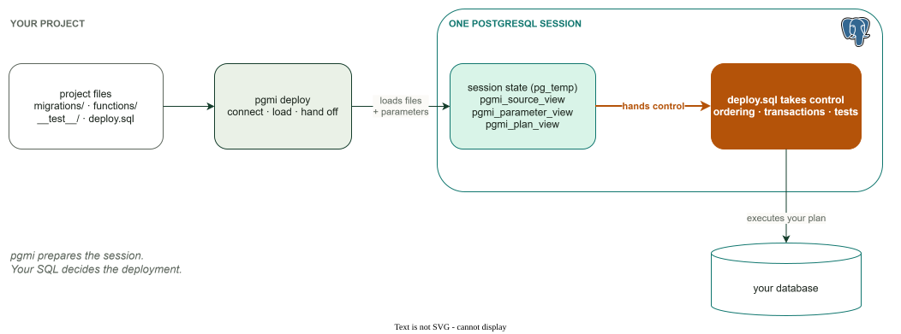

# pgmi Documentation

pgmi is a PostgreSQL-native deployment tool that loads your project files into session temp tables and lets your `deploy.sql` drive everything — transactions, execution order, and logic. These docs cover the session API, CLI, deployment patterns, testing, security, and operational guides.



## Recommended Reading Order

**New to pgmi?** Start here:
1. [Quickstart](QUICKSTART.md) — Deploy your first project
2. [Why pgmi](WHY-PGMI.md) — Understand the philosophy
3. [Core vs. template](core-vs-template.md) — What pgmi gives you, and what you own
4. [Highlights](HIGHLIGHTS.md) — What pgmi does that other tools can't
5. [Session API](session-api.md) — Learn the session API
6. [Trade-offs](TRADEOFFS.md) — Understand the honest costs

**Migrating from another tool?**
1. [Coming from other tools](COMING-FROM.md) — Flyway, Liquibase, psql migration guides
2. [Quickstart](QUICKSTART.md) — See pgmi in action

**Writing deploy.sql?**
1. [deploy.sql guide](DEPLOY-GUIDE.md) — Patterns cookbook (data ingestion, environment branching, multi-phase)
2. [Session API](session-api.md) — Views, columns, and functions reference

**Setting up production?**
1. [Connections](CONNECTIONS.md) — Connection architecture (cloud auth, SSL, poolers)
2. [Security](SECURITY.md) — Secrets and CI/CD patterns
3. [CI/CD](CICD.md) — Deploy from GitHub Actions and other pipelines
4. [Production](PRODUCTION.md) — Performance and rollback strategies
5. [CLI reference](CLI.md) — All flags and exit codes

**Adding tests?**
1. [Testing](TESTING.md) — `CALL pgmi_test()` and fixtures

**Using the advanced template?**
1. [Advanced template overview](advanced/_index.md) — The application stack and the basic/advanced boundary
2. [Script metadata](METADATA.md) — Script tracking with `<pgmi-meta>`
3. [MCP gateway](advanced/MCP.md) — Expose your deployed application to AI assistants
4. [API keys](advanced/API-KEYS.md) — Authenticate callers of your generated APIs

---

## Quick Answers

| Question | Answer |
|----------|--------|
| Which view should I use? | `pgmi_plan_view` for deployment, `pgmi_source_view` for introspection — see [Session API](session-api.md#which-view-should-i-use) |
| How do I access CLI parameters? | `current_setting('pgmi.key', true)` — see [Session API](session-api.md#parameters) |
| How do I run tests? | `CALL pgmi_test()` in deploy.sql — see [Testing](TESTING.md) |
| What's the difference between templates? | Basic = small, explicit migration scaffold. Advanced = ~19k lines of tested SQL application stack (one handler registry → REST+RPC+MCP+OpenAPI, RLS auth, transaction policy, audit trails) — more infrastructure, not a higher safety tier. Either is production-capable; see [Quickstart](QUICKSTART.md#choosing-a-template) and the [capability tour](advanced/_index.md) |
| How do I filter which files run? | Join `pgmi_plan_view` to `pgmi_source_view`, require `is_sql_file`, then add your path filter — see [Session API](session-api.md) |
| What exit codes does pgmi use? | 0=success, 13=SQL error, etc. — see [CLI reference](CLI.md#exit-codes) |

---

## All Documentation

### Getting Started
- **[Quickstart](QUICKSTART.md)** — Your first deployment (install, configure, deploy, verify)
- **[Why pgmi](WHY-PGMI.md)** — When pgmi's approach makes sense (and when it doesn't)
- **[Core vs. template](core-vs-template.md)** — The boundary between pgmi core and your scaffolded project
- **[Highlights](HIGHLIGHTS.md)** — Ten distinctive pgmi capabilities, grounded in code and guides
- **[Coming from other tools](COMING-FROM.md)** — Migration guides from Flyway, Liquibase, and raw psql

### Reference
- **[CLI reference](CLI.md)** — Complete CLI reference (commands, flags, exit codes, error messages)
- **[Configuration](CONFIGURATION.md)** — pgmi.yaml schema and precedence rules
- **[Session API](session-api.md)** — Session views and functions (`pg_temp.pgmi_*`)

### Guides
- **[deploy.sql guide](DEPLOY-GUIDE.md)** — deploy.sql authoring patterns (data ingestion, environment branching, multi-phase)
- **[Connections](CONNECTIONS.md)** — Connection architecture (cloud auth, SSL, poolers, IaC)
- **[Trade-offs](TRADEOFFS.md)** — Honest limitations and who should use pgmi

### Features
- **[Testing](TESTING.md)** — Database testing with savepoint isolation and deploy gates
- **[Script metadata](METADATA.md)** — Script tracking with UUIDs, idempotency, sort keys
- **[Security](SECURITY.md)** — Secrets handling and CI/CD patterns

### Operations
- **[CI/CD](CICD.md)** — Deploy from GitHub Actions and other pipelines
- **[Production](PRODUCTION.md)** — Performance, rollback strategies, monitoring

### Advanced template (~19k lines you own)
These pages document application code scaffolded by `pgmi init --template advanced` — a complete PostgreSQL application stack, not a pgmi core feature. The generated SQL and gateways become code you own, modify, or delete. Start at the [capability tour](advanced/_index.md).

- **[MCP gateway](advanced/MCP.md)** — Expose your deployed application's tools, resources, and prompts to AI assistants over HTTP
- **[API keys](advanced/API-KEYS.md)** — API key authentication for callers of your generated REST/RPC/MCP APIs
- **[Client guides](advanced/clients/_index.md)** — Generate typed clients from your deployment's OpenAPI contract
- **[Transaction policy](advanced/TRANSACTION-POLICY.md)** — Per-route isolation floor, read-only declaration, DEFERRABLE derivation, fail-closed enforcement, replica-safe hint
- **[MCP gateway](advanced/MCP-GATEWAY.md)** — Gateway internals: routing, auth, transaction lifecycle, OpenAPI generation
- **[MCP handlers](advanced/MCP-HANDLERS.md)** — Authoring MCP tool/resource/prompt handlers
- **[MCP protocol](advanced/MCP-PROTOCOL.md)** — JSON-RPC wire protocol and session lifecycle
- **[MCP SQL API](advanced/MCP-SQL-API.md)** — SQL functions powering the MCP gateway
- **[Semantic MCP curation](advanced/semantic-mcp-tool-curation.md)** — Optional extension to the MCP gateway: surface the relevant tool subset by embedding similarity (for tool-overload scale)

### AI Integration
```bash
pgmi ai                    # Overview for AI assistants
pgmi ai skills             # List embedded skills
pgmi ai skill pgmi-sql     # Load SQL conventions
```
See [CLI.md#pgmi-ai](CLI.md#pgmi-ai) for details.
