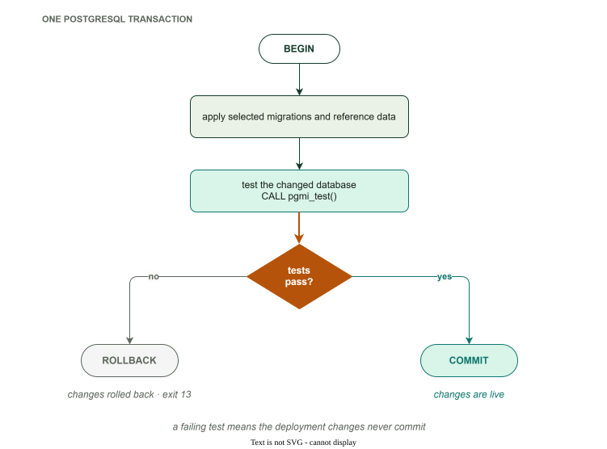
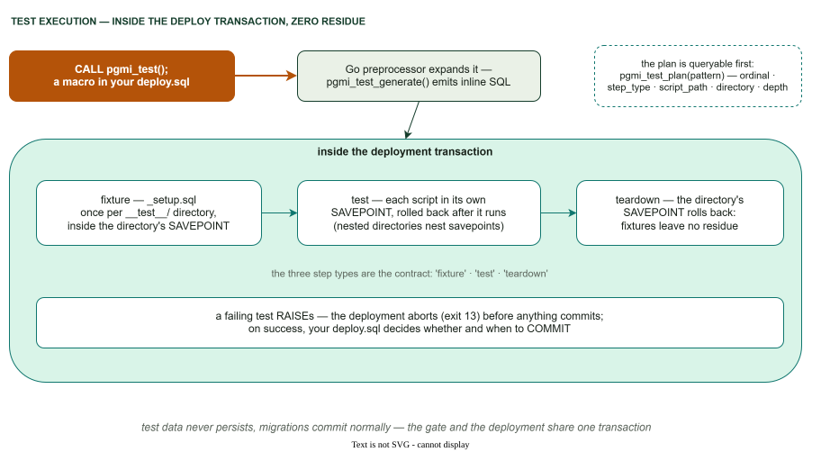

# Database Testing with pgmi

This guide teaches you how to test your PostgreSQL code using pgmi — from your first test to hierarchical fixtures. Every example is copy-paste ready.

---

## The problem pgmi solves

Testing database code is hard because **changes persist**. If a test creates a table, that table exists for the next test. If a test inserts rows, those rows are visible to every test that follows. Tests become order-dependent, flaky, and impossible to run in isolation.

Most teams solve this with cleanup scripts — `DELETE FROM`, `DROP TABLE IF EXISTS`, teardown hooks. This is fragile. Miss one cleanup step and your test suite breaks in subtle, hard-to-debug ways.

pgmi takes a different approach: **your tests never leave permanent changes in the database.**



**Video walkthrough:** [Transactional Testing with pgmi](https://youtu.be/mSqHOQIJ_uk)

---

## How it works (the short version)

When you use the `CALL pgmi_test()` macro in your `deploy.sql`, pgmi:

1. Expands the macro into inline SQL with savepoint management
2. Runs your fixtures and tests inside savepoints
3. Rolls back each test's changes via savepoint rollback

Test data never persists. Your migrations commit, but test state is isolated. Every time.

PostgreSQL **savepoints** isolate each test from every other test. Each test gets a clean copy of the fixture state, regardless of what previous tests did.

You don't manage any of this. You write SQL in `__test__/` directories and call `CALL pgmi_test()` in your deploy.sql.

---

## Your first test

Start from a project created with `pgmi init myapp --template basic`. It already
ships everything the test machinery needs:

```
myapp/
├── deploy.sql              ← already calls CALL pgmi_test()
├── pgmi.yaml
├── migrations/
│   ├── 001_users.sql       ← creates the "user" table
│   └── 002_user_crud.sql
└── __test__/               ← already here, at the project root
    ├── _setup.sql          ← seeds alice/bob/charlie
    └── test_user_crud.sql
```

`001_users.sql` creates the table you will write against. Note the name: it is
**`"user"`, singular and quoted** — `user` is a reserved word in PostgreSQL, so
every reference to it needs the quotes.

```sql
CREATE TABLE IF NOT EXISTS "user" (
    id INT GENERATED ALWAYS AS IDENTITY PRIMARY KEY,
    email TEXT NOT NULL UNIQUE,
    name TEXT,
    created_at TIMESTAMPTZ DEFAULT NOW()
);
```

### Step 1: Add a test file

There is no directory to create — `__test__/` is already there. The name
`__test__` (or `__tests__`) is special: pgmi loads those files into a separate
view, so a deployment loop cannot execute one by accident.

### Step 2: Write the test

Create `__test__/test_user_table.sql`:

```sql
DO $$
DECLARE
    v_email TEXT := 'dana@example.com';
BEGIN
    -- _setup.sql already seeded three users; add a fourth.
    INSERT INTO "user" (email, name) VALUES (v_email, 'Dana');

    IF NOT EXISTS (SELECT 1 FROM "user" WHERE email = v_email) THEN
        RAISE EXCEPTION 'TEST FAILED: user was not inserted';
    END IF;

    IF (SELECT name FROM "user" WHERE email = v_email) IS DISTINCT FROM 'Dana' THEN
        RAISE EXCEPTION 'TEST FAILED: name did not round-trip';
    END IF;

    RAISE NOTICE 'PASS: "user" accepts an insert and reads it back';
END $$;
```

Tests are plain SQL. `RAISE EXCEPTION` stops execution immediately with a clear
message; a passing test finishes silently, or with a `RAISE NOTICE` for your own
visibility.

`IS DISTINCT FROM` rather than `!=` is deliberate. `SELECT ... INTO` is not
`STRICT` and a missing row yields NULL, and `NULL != 'Dana'` is NULL — not true —
so an `IF` built on `!=` takes no branch and the assertion silently disappears.
See [Assertions must be able to fail](#assertions-must-be-able-to-fail).

### Step 3: Deploy

Your `deploy.sql` already runs the suite — this is the block the scaffold ships:

```sql
-- Run tests (savepoint ensures test side effects roll back)
SAVEPOINT _tests;
CALL pgmi_test();
ROLLBACK TO SAVEPOINT _tests;

COMMIT;
```

So there is nothing to edit. Just deploy:

```bash
pgmi deploy . --overwrite --force
```

```
Dev seed: admin user ready (admin@example.com id=1)
[pgmi] Test suite started
[pgmi] Fixture: ./__test__/_setup.sql
[pgmi] Test: ./__test__/test_user_crud.sql
[pgmi] Test: ./__test__/test_user_table.sql
PASS: "user" accepts an insert and reads it back
[pgmi] Test suite completed (4 steps)
✓ myapp: 8 files loaded, 1 test macro(s) expanded in 6.07s
```

### Step 4: Check your database

```bash
psql -h localhost -U postgres -d myapp -c 'SELECT * FROM "user";'
```

```
 id |       email       |     name      |          created_at
----+-------------------+---------------+-------------------------------
  1 | admin@example.com | Administrator | 2026-07-27 18:47:36.515231+00
(1 row)
```

**One row — the dev seed, and nothing else.** Alice, Bob and Charlie from the
fixture are gone, and so is Dana from the test. Everything the suite touched was
rolled back; only the deployment itself committed.

---

## Fixtures: shared setup for multiple tests

When you have multiple tests that all need the same starting data, you don't want to repeat the setup in every test file. That's what **fixtures** are for.

A fixture is a file named `_setup.sql` inside a `__test__` directory. pgmi runs it before the tests in that directory, and every test sees the same fixture state — even if a previous test modified or deleted the data.

### Example

```
migrations/
├── 001_initial.sql          ← Creates the users table
└── __test__/
    ├── _setup.sql            ← Inserts test data (the fixture)
    ├── test_insert.sql       ← Tests inserting a new user
    └── test_count.sql        ← Tests counting users
```

**`_setup.sql`** — the fixture:

```sql
INSERT INTO users (name, email) VALUES
    ('Alice', 'alice@example.com'),
    ('Bob', 'bob@example.com');
```

**`test_insert.sql`**:

```sql
DO $$
DECLARE
    v_count INT;
BEGIN
    -- Fixture gave us 2 users. Insert a third.
    INSERT INTO users (name, email) VALUES ('Charlie', 'charlie@example.com');

    SELECT COUNT(*) INTO v_count FROM users;
    IF v_count != 3 THEN
        RAISE EXCEPTION 'TEST FAILED: Expected 3 users, got %', v_count;
    END IF;

    RAISE NOTICE 'PASS: insert works (3 users after insert)';
END $$;
```

**`test_count.sql`**:

```sql
DO $$
DECLARE
    v_count INT;
BEGIN
    -- This test also sees exactly 2 users from the fixture.
    -- Charlie from test_insert.sql is NOT here — that test was rolled back.
    SELECT COUNT(*) INTO v_count FROM users;
    IF v_count != 2 THEN
        RAISE EXCEPTION 'TEST FAILED: Expected 2 users from fixture, got %', v_count;
    END IF;

    RAISE NOTICE 'PASS: fixture provides exactly 2 users';
END $$;
```

Deploy (with `pgmi_test()` in your deploy.sql):

```bash
pgmi deploy . --overwrite --force
```

```
PASS: insert works (3 users after insert)
PASS: fixture provides exactly 2 users
```

Both tests pass. `test_count.sql` sees exactly 2 users even though `test_insert.sql` added a third. The savepoint rollback erased Charlie before running `test_count.sql`.

**This is the core guarantee: every test starts from the exact fixture state, no matter what.**

---

## Execution model



Here's the structure pgmi generates for the example above. Understanding this is optional, but it explains why the guarantee works.

```
BEGIN;                                  ← outer transaction

    SAVEPOINT sp_setup_root;            ← fixture boundary (top-level SQL)
    DO $$ ... _setup.sql content ... $$ ← fixture runs via EXECUTE

        SAVEPOINT sp_test_1;            ← test boundary (top-level SQL)
        DO $$ ... test_insert.sql ... $$ ← test runs via EXECUTE
        ROLLBACK TO sp_test_1;          ← undo test_insert.sql changes

        SAVEPOINT sp_test_2;            ← test boundary (top-level SQL)
        DO $$ ... test_count.sql ... $$ ← test runs via EXECUTE
        ROLLBACK TO sp_test_2;          ← undo test_count.sql changes

    ROLLBACK TO sp_setup_root;          ← undo fixture (Alice, Bob gone)
    RELEASE SAVEPOINT sp_setup_root;    ← clean up savepoint

COMMIT;                                 ← migrations persist, test data gone
```

The `ROLLBACK TO sp_test_1` after `test_insert.sql` is what erases Charlie. The database state returns to exactly what `_setup.sql` created. Then `test_count.sql` runs against that clean state.

The `ROLLBACK TO sp_setup_root` at the end erases even the fixture data.

**Key implementation detail:** The SAVEPOINT commands are generated as **top-level SQL statements**, not inside PL/pgSQL blocks. PostgreSQL's PL/pgSQL does not support savepoints directly — you cannot use `EXECUTE 'SAVEPOINT ...'` inside a DO block. pgmi's `pgmi_test_generate()` function produces inline SQL where savepoints are at the top level, with test content wrapped in separate DO blocks that use EXECUTE.

**PostgreSQL's transactional savepoints do all the work.** pgmi just generates the right savepoint structure. No cleanup scripts. No teardown hooks. No manual state management.

---

## Hierarchical fixtures

Real projects have groups of related tests, each needing different base data. pgmi supports this with nested `__test__` directories where each level adds its own fixture.

### Example: an e-commerce project

```
migrations/
├── 001_schema.sql
└── __test__/
    ├── _setup.sql                    ← Base fixture: creates 2 users
    ├── test_user_count.sql
    │
    ├── orders/
    │   ├── _setup.sql                ← Adds orders for the 2 users
    │   ├── test_order_total.sql
    │   └── test_order_status.sql
    │
    └── admin/
        ├── _setup.sql                ← Adds an admin role
        └── test_admin_access.sql
```

**Root `_setup.sql`**:
```sql
INSERT INTO users (name, email) VALUES
    ('Alice', 'alice@example.com'),
    ('Bob', 'bob@example.com');
```

**`orders/_setup.sql`**:
```sql
-- This runs AFTER root _setup.sql.
-- Alice and Bob already exist.
INSERT INTO orders (user_id, total, status) VALUES
    (1, 99.99, 'pending'),
    (2, 149.50, 'shipped');
```

**`admin/_setup.sql`**:
```sql
-- This also runs after root _setup.sql.
-- Alice and Bob exist, but NO orders (orders fixture is separate).
INSERT INTO user_roles (user_id, role) VALUES (1, 'admin');
```

pgmi executes this structure as nested savepoints:

```
BEGIN;

    SAVEPOINT sp_root_setup;                ← Root fixture (Alice, Bob)
    ... _setup.sql ...

        SAVEPOINT sp_test_user_count;       ← Test against root fixture
        ... test_user_count.sql ...
        ROLLBACK TO sp_test_user_count;

        SAVEPOINT sp_orders_setup;          ← Orders fixture (adds orders)
        ... orders/_setup.sql ...

            SAVEPOINT sp_test_order_total;
            ... test_order_total.sql ...
            ROLLBACK TO sp_test_order_total;

            SAVEPOINT sp_test_order_status;
            ... test_order_status.sql ...
            ROLLBACK TO sp_test_order_status;

        ROLLBACK TO sp_orders_setup;        ← Undo orders fixture
        RELEASE SAVEPOINT sp_orders_setup;  ← Clean up savepoint

        SAVEPOINT sp_admin_setup;           ← Admin fixture (adds role)
        ... admin/_setup.sql ...

            SAVEPOINT sp_test_admin_access;
            ... test_admin_access.sql ...
            ROLLBACK TO sp_test_admin_access;

        ROLLBACK TO sp_admin_setup;         ← Undo admin fixture
        RELEASE SAVEPOINT sp_admin_setup;   ← Clean up savepoint

    ROLLBACK TO sp_root_setup;              ← Undo root fixture
    RELEASE SAVEPOINT sp_root_setup;        ← Clean up savepoint

COMMIT;                                     ← Migrations persist, test data gone
```

**What each test sees:**

| Test | Users | Orders | Admin role |
|------|-------|--------|------------|
| `test_user_count.sql` | Alice, Bob | none | none |
| `test_order_total.sql` | Alice, Bob | 2 orders | none |
| `test_order_status.sql` | Alice, Bob | 2 orders | none |
| `test_admin_access.sql` | Alice, Bob | none | Alice is admin |

Each subdirectory gets its parent's fixture plus its own. Tests in `orders/` see users and orders but no admin role. Tests in `admin/` see users and the admin role but no orders. The fixtures compose, and each level is fully isolated.

A level in between may hold no files of its own. `__test__/api/v2/test_x.sql` with an empty `__test__/api/` composes against the `__test__/` fixture; the empty level contributes nothing and needs no `_setup.sql`.

---

## Filtering tests

You don't have to run everything every time. Pass a pattern to `CALL pgmi_test()`:

```sql
-- In deploy.sql

-- Run only order-related tests
CALL pgmi_test('.*/orders/.*');

-- Run only a specific test file
CALL pgmi_test('.*test_admin_access.*');

-- Run all tests (default)
CALL pgmi_test();
```

When you filter, pgmi automatically includes all ancestor fixtures. If you run `pgmi_test('.*/orders/.*')`, pgmi still runs the root `_setup.sql` (because `orders/_setup.sql` depends on it) — you don't need to think about this.

A pattern that matches nothing **fails the deploy** (`no_data_found`) rather than passing quietly. So does `CALL pgmi_test()` in a project with no test files at all. A gate that gated on nothing is not a gate, and the most common cause is a typo in the pattern or a misplaced `__test__/` directory — neither should look like a green deploy.

---

## Writing effective tests

### The pattern

Every test follows the same shape:

```sql
DO $$
BEGIN
    -- 1. Do something (or not — test the existing fixture state)
    -- 2. Check the result
    -- 3. RAISE EXCEPTION if wrong, RAISE NOTICE if right
END $$;
```

### Assertions must be able to fail

An `IF` whose condition evaluates to NULL takes **no branch**. So an assertion
built from a NULL-yielding operator does not fail when the code is wrong — it
disappears, and the deploy still prints its checkmark.

The NULL usually comes from missing data, which is exactly the state a test
exists to catch: `SELECT ... INTO` is not `STRICT`, `jsonb ->>` and `hstore ->`
return NULL for an absent key, `array_length('{}', 1)` is NULL rather than 0, and
`=`, `<>`, `<` and `LIKE` all propagate that NULL outward.

```sql
-- Passes when the row, the key or the header is missing
IF v_user.name != 'Dana' THEN
IF NOT v_info.is_active THEN
IF v_body->>'status' != 'ok' THEN
IF array_length(v_ids, 1) < 1 THEN

-- Fires on a wrong value AND on a missing one
IF v_user.name IS DISTINCT FROM 'Dana' THEN
IF v_info.is_active IS DISTINCT FROM true THEN
IF v_body->>'status' IS DISTINCT FROM 'ok' THEN
IF coalesce(array_length(v_ids, 1), 0) < 1 THEN
```

Where several assertions read one record, guard the source once instead:

```sql
SELECT * INTO v_user FROM "user" WHERE email = v_email;
IF NOT FOUND THEN
    RAISE EXCEPTION 'TEST FAILED: no user row for %', v_email;
END IF;
```

`EXISTS` is total by construction and needs no guard. And do not assert on what
the code under test *reports*: a function returning `{"deleted": 10}` while
deleting nothing satisfies every check made against its return value — re-query
the table.

### Testing a function

```sql
DO $$
DECLARE
    v_result BOOLEAN;
BEGIN
    v_result := validate_email('user@example.com');
    IF NOT v_result THEN
        RAISE EXCEPTION 'Valid email was rejected';
    END IF;

    v_result := validate_email('not-an-email');
    IF v_result THEN
        RAISE EXCEPTION 'Invalid email was accepted';
    END IF;

    RAISE NOTICE 'PASS: email validation';
END $$;
```

### Testing an expected error

```sql
DO $$
BEGIN
    -- This should fail with a constraint violation
    BEGIN
        INSERT INTO users (name, email) VALUES (NULL, 'test@example.com');
        RAISE EXCEPTION 'TEST FAILED: NULL name was accepted (should violate NOT NULL)';
    EXCEPTION
        WHEN not_null_violation THEN
            RAISE NOTICE 'PASS: NOT NULL constraint on name works';
    END;
END $$;
```

### Testing with data from the fixture

```sql
DO $$
DECLARE
    v_total NUMERIC;
BEGIN
    -- Fixture already inserted orders. Just query and verify.
    SELECT SUM(total) INTO v_total FROM orders;
    IF v_total != 249.49 THEN
        RAISE EXCEPTION 'TEST FAILED: Expected total 249.49, got %', v_total;
    END IF;

    RAISE NOTICE 'PASS: order totals sum correctly';
END $$;
```

---

## What you don't need to do

Because pgmi manages the transaction lifecycle, you skip the entire category of problems that make database testing painful:

| Traditional approach | With pgmi |
|---------------------|-----------|
| Write `teardown.sql` to clean up after tests | Not needed — savepoint rollback handles it |
| Worry about test execution order | Not needed — each test starts from fixture state |
| Manage test database separately | Not needed — tests run against your real deployment, then vanish |
| Build a test runner or assertion framework | Not needed — `RAISE EXCEPTION` is the assertion |
| Truncate tables, drop temp objects, clean up test state | Not needed — outer `ROLLBACK` erases everything (note: sequence advances from `nextval()` are not rolled back — this is standard PostgreSQL behavior) |

---

## The gated deployment pattern

The `CALL pgmi_test()` macro runs tests **as a gate before committing** — if any test fails, the entire deployment rolls back and your database is unchanged. An empty test plan (no `__test__/` files, or a pattern that matches nothing) also fails the deploy with `no_data_found` — a gate that gated on nothing is not a gate.

### How it works

pgmi uses a **direct execution model**: your `deploy.sql` queries files from `pgmi_plan_view` and executes them directly with `EXECUTE`. The `pgmi_test()` preprocessor macro expands into inline SQL that handles test execution with automatic savepoints.

Here's a `deploy.sql` that deploys your schema and gates the commit on tests passing:

```sql
BEGIN;

DO $$
DECLARE
    v_file RECORD;
BEGIN
    -- Execute each migration file directly
    FOR v_file IN (
        SELECT p.path, p.content
        FROM pg_temp.pgmi_plan_view p
        JOIN pg_temp.pgmi_source_view s ON s.path = p.path
        WHERE s.is_sql_file AND p.path LIKE './migrations/%'
        ORDER BY p.execution_order
    )
    LOOP
        RAISE NOTICE 'Executing: %', v_file.path;
        EXECUTE v_file.content;
    END LOOP;
END $$;

-- Run all tests (preprocessor macro expands to test execution with savepoints)
CALL pgmi_test();

COMMIT;
```

The `CALL pgmi_test()` macro is expanded by pgmi before the SQL reaches PostgreSQL. It generates the entire savepoint structure — every fixture setup, every test wrapped in its own savepoint, every rollback.

### What happens at runtime

```
1.  BEGIN;
2.  <contents of 001_initial.sql>       ← EXECUTE v_file.content
3.  <contents of 002_add_email.sql>     ← EXECUTE v_file.content
4.  SAVEPOINT sp_setup_root;            ┐
5.  <_setup.sql contents>               │
6.  SAVEPOINT sp_test_1;                │
7.  <test_insert.sql contents>          │  expanded from
8.  ROLLBACK TO sp_test_1;              │  pgmi_test()
9.  SAVEPOINT sp_test_2;                │
10. <test_count.sql contents>           │
11. ROLLBACK TO sp_test_2;              │
12. ROLLBACK TO sp_setup_root;          ┘
13. COMMIT;
```

If any test raises an exception (steps 6–11), PostgreSQL aborts the transaction and `COMMIT` at step 13 never runs. Your migrations from steps 2–3 are rolled back. **The database is unchanged.**

If all tests pass, the savepoints roll back the test data (so it doesn't persist), but the migrations remain, and `COMMIT` makes them permanent.

**Successful deployment implies all tests passed. Failed tests mean zero changes to your database.**

---

## Running tests

Tests run as part of deployment via the `CALL pgmi_test()` macro in your `deploy.sql`:

```sql
-- deploy.sql
BEGIN;

-- ... your migrations ...

-- Run all tests
CALL pgmi_test();

-- Or filter by pattern
-- CALL pgmi_test('.*/orders/.*');

COMMIT;
```

```bash
# Deploy with tests
pgmi deploy . --overwrite --force

# Verbose output (shows PostgreSQL DEBUG messages)
pgmi deploy . --overwrite --force --verbose
```

The `CALL pgmi_test()` macro:
- Runs **only** files from `__test__/` or `__tests__/` directories
- Uses **savepoints** to isolate each test — test data never persists
- Stops at the **first failure** — no partial results to interpret
- Gates the `COMMIT` — failed tests mean zero changes to your database

---

## Custom test callbacks

The default test callback emits NOTICE messages (`[pgmi] Test: ...`). You can replace it with a custom PL/pgSQL function to produce structured output, log results to a table, or integrate with external reporting.

```sql
CALL pgmi_test('.*/orders/.*', 'pg_temp.my_test_callback');
```

**Schema-qualify the name.** pgmi interpolates it verbatim into
`SELECT <name>(ROW(...))`, and PostgreSQL never searches `pg_temp` for *function*
names however the `search_path` is set. An unqualified name fails with
`ERROR: function my_test_callback(pgmi_test_event) does not exist (SQLSTATE 42883)`.

Your callback function must accept a single `pg_temp.pgmi_test_event` composite type parameter and return void:

```sql
CREATE OR REPLACE FUNCTION pg_temp.my_test_callback(e pg_temp.pgmi_test_event)
RETURNS void AS $$
BEGIN
    CASE e.event
        WHEN 'fixture_start' THEN
            RAISE NOTICE '[FIXTURE] %', e.path;
        WHEN 'test_start' THEN
            RAISE NOTICE '[TEST] %', e.path;
        WHEN 'teardown_start' THEN
            RAISE NOTICE '[TEARDOWN] %', e.directory;
        ELSE
            RAISE NOTICE '[%] %', e.event, COALESCE(e.path, e.directory);
    END CASE;
END;
$$ LANGUAGE plpgsql;
```

Against the scaffolded basic template that produces:

```
[suite_start]
[FIXTURE] ./__test__/_setup.sql
[fixture_end] ./__test__/_setup.sql
[TEST] ./__test__/test_user_crud.sql
[test_end] ./__test__/test_user_crud.sql
[rollback] ./__test__/test_user_crud.sql
[TEARDOWN] ./__test__/
[teardown_end] ./__test__/
[suite_end]
```

`suite_start` is the first event dispatched and falls to the `ELSE` branch, so a
mistake there — one `%` too many, say — kills the suite on step one before any
test runs.

**The `pgmi_test_event` composite type:**

| Field | Type | Description |
|-------|------|-------------|
| `event` | TEXT | Event name (see table below) |
| `path` | TEXT | Script path (NULL for suite/teardown events) |
| `directory` | TEXT | Test directory containing the script |
| `depth` | INT | Nesting level (0 = root `__test__/`) |
| `ordinal` | INT | Execution order (1-based, monotonically increasing) |
| `context` | JSONB | Extensible payload for custom data |

**Events dispatched:**

| Event | path | directory | When |
|-------|------|-----------|------|
| `suite_start` | NULL | `''` | Before the test suite begins |
| `fixture_start` | Path to `_setup.sql` | Fixture directory | Before executing a fixture |
| `fixture_end` | Path to `_setup.sql` | Fixture directory | After executing a fixture |
| `test_start` | Path to test file | Test directory | Before executing a test |
| `test_end` | Path to test file | Test directory | After executing a test |
| `rollback` | Path or NULL | Directory | After rolling back a test savepoint |
| `teardown_start` | NULL | Directory being torn down | Before rolling back a directory's savepoint |
| `teardown_end` | NULL | Directory being torn down | After rolling back a directory's savepoint |
| `suite_end` | NULL | `''` | After the test suite completes (ordinal = total steps) |

**Example: logging results to a table**

```sql
CREATE TEMP TABLE test_log (
    ordinal SERIAL,
    event TEXT,
    path TEXT,
    logged_at TIMESTAMPTZ DEFAULT clock_timestamp()
);

CREATE OR REPLACE FUNCTION pg_temp.logging_callback(e pg_temp.pgmi_test_event)
RETURNS void AS $$
BEGIN
    INSERT INTO pg_temp.test_log (event, path) VALUES (e.event, e.path);
END;
$$ LANGUAGE plpgsql;

-- Use the logging callback
CALL pgmi_test(NULL, 'pg_temp.logging_callback');

-- Query results after tests run
SELECT * FROM pg_temp.test_log ORDER BY ordinal;
```

**Example: TAP 14 reporter** ([full example](../examples/tap-reporter/))

```sql
CREATE SEQUENCE pg_temp._pgmi_tap_seq;

CREATE OR REPLACE FUNCTION pg_temp.pgmi_tap_callback(e pg_temp.pgmi_test_event)
RETURNS void
LANGUAGE plpgsql AS $$
DECLARE
    v_test_count int;
BEGIN
    CASE e.event
        WHEN 'suite_start' THEN
            RAISE NOTICE 'TAP version 14';
            SELECT count(*) INTO v_test_count
            FROM pg_temp.pgmi_test_plan()
            WHERE step_type = 'test';
            RAISE NOTICE '1..%', v_test_count;
        WHEN 'test_end' THEN
            RAISE NOTICE 'ok % - %', nextval('pg_temp._pgmi_tap_seq'), e.path;
        ELSE
            NULL;
    END CASE;
END;
$$;

CALL pgmi_test(NULL, 'pg_temp.pgmi_tap_callback');
```

Produces:

```
TAP version 14
1..2
ok 1 - ./__test__/test_insert.sql
ok 2 - ./__test__/test_update.sql
```

The plan line (`1..2`) is emitted first from `pgmi_test_plan()`, so a TAP consumer
that sees fewer `ok` lines than planned knows the suite aborted mid-run. The
sequence is non-transactional — `nextval()` advances survive savepoint rollback,
keeping test numbers monotonic.

---

## Teardown

pgmi uses **implicit teardown via savepoint rollback** — there are no explicit teardown scripts. When a directory's tests finish, pgmi rolls back to the savepoint created before the directory's fixture, undoing all changes from both the fixture and the tests.

```
SAVEPOINT sp_orders_setup;          ← fixture boundary
... orders/_setup.sql ...           ← fixture creates data
    SAVEPOINT sp_test_1;
    ... test_order_total.sql ...    ← test modifies data
    ROLLBACK TO sp_test_1;          ← test changes undone
ROLLBACK TO sp_orders_setup;        ← fixture + everything undone
```

This means:
- No `_teardown.sql` convention — rollback handles cleanup
- No manual `DELETE FROM` or `DROP TABLE` in test files
- DML changes, temp objects, and DDL are all reverted (note: `nextval()` advances are permanent — sequences are non-transactional in PostgreSQL, so tests may see gaps in sequence values, which is harmless)

**When implicit teardown isn't enough:** If your tests create objects outside the transaction (e.g., `CREATE INDEX CONCURRENTLY`), those cannot be rolled back. Avoid non-transactional operations in tests.

---

## Comparison with alternatives

| Approach | Isolation | Speed | Requires Docker | Real PostgreSQL | Gate location |
|----------|-----------|-------|-----------------|-----------------|---------------|
| **pgmi (savepoints)** | Per-test rollback | Fast (no I/O) | No | Yes | Inside the deploy transaction, against the target |
| **Atlas ([`migrate test`](https://atlasgo.io/testing/migrate))** | Dev-database container | Fast | Yes (`docker://`) | Yes (dev copy) | Before the apply, against a dev database |
| **Testcontainers** | Fresh database per test | Slow (container startup) | Yes | Yes | Separate CI step |
| **pgTAP** | None (manual cleanup) | Fast | No | Yes | Separate `pg_prove` run |
| **ORM rollback** | Transaction per test | Fast | No | ORM subset only | Application test suite |
| **Neon branching** | Copy-on-write branch | Fast (API call) | No | Yes (managed) | Separate step against the branch |

**pgmi's advantage:** Tests run against the actual deployment (real schema, real data, real transactions) with zero infrastructure. No Docker, no API calls, no separate test database. The test gate is the deploy transaction itself — a failing test means the commit never happened and the target database is unchanged. Other tools test before the apply or against a copy; pgmi tests *the apply*.

**No report format ships built in.** pgmi emits a typed *event stream* rather than
a fixed report: `suite_start`, `fixture_start`, `test_start`, `test_end`, `rollback`,
`teardown_end`, each carrying path, directory, depth and ordinal. The default
[callback](#custom-test-callbacks) turns that into NOTICEs; substituting your own is
how you get TAP, JUnit XML, or a row per test in a results table — from the same run,
without a second execution mode. → [Working TAP 14 reporter](../examples/tap-reporter/)

---

## Compliance and gated deployment

The [gated deployment pattern](#the-gated-deployment-pattern) provides auditable evidence that tests passed before changes were committed:

1. Migrations run inside `BEGIN`
2. `CALL pgmi_test()` executes all tests
3. If any test fails → `RAISE EXCEPTION` → transaction aborts → database unchanged
4. If all tests pass → `COMMIT` → changes persist

**For regulated environments:** The combination of test-gated commits and the advanced template's `internal.deployment_script_execution_log` provides a deployment audit trail: which scripts ran, when, by whom, with what checksums. Tests passing is a precondition for the commit — there is no way to commit with failing tests, and no way to commit with an empty test plan (the macro refuses to pass when it discovers nothing to run).

```sql
-- After deployment, query the audit trail
SELECT file_path, executed_at, executed_by, deployment_script_content_checksum
FROM internal.deployment_script_execution_log
ORDER BY executed_at;
```

---

## Troubleshooting

### "relation does not exist"

Your test references a table that hasn't been deployed yet. Ensure your migrations run before `pgmi_test()` in your deploy.sql.

### Test passes alone but fails with others

This usually means one test depends on state from another test (a row it inserted, a sequence value). Fix: move the shared state into `_setup.sql` so every test gets it from the fixture.

### Fixture is getting too large

Split into subdirectories. Each subdirectory gets its own `_setup.sql` that builds on the parent fixture. See [Hierarchical fixtures](#hierarchical-fixtures).

### Tests are slow

Each test creates and rolls back a savepoint. This is fast for PostgreSQL. If tests are slow, the bottleneck is likely your SQL logic, not the test framework. Check for missing indexes or expensive queries in your fixtures.
