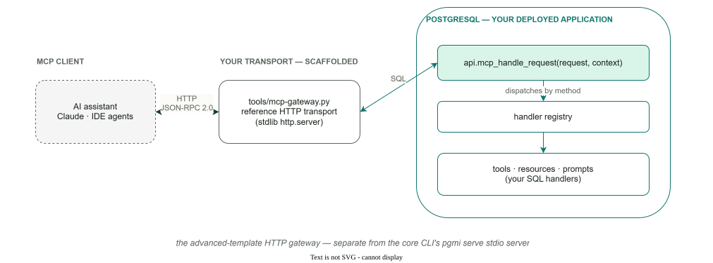

# Advanced Template: MCP Gateway

> **Scope: advanced template only.** This subsystem is scaffolded by
> `pgmi init --template advanced`. It is not part of pgmi core and is not
> included in the basic template. The generated SQL and gateway become
> application code that you own.

pgmi has **two unrelated MCP surfaces** — be sure you're reading about the right one:

- **`pgmi serve`** (part of the CLI, every install): exposes pgmi's project-inspection commands as an MCP server over stdio, so a coding agent can drive pgmi itself. See the [CLI reference](../CLI.md).
- **The advanced-template MCP gateway** (this section): exposes *your deployed PostgreSQL application* — its tools, resources, and prompts — to AI assistants over HTTP.

The Model Context Protocol (MCP) is an open standard that allows AI
applications (Claude Desktop, VS Code Copilot, etc.) to connect to external
systems. The advanced template implements MCP entirely in PostgreSQL, with a
thin HTTP gateway for transport.

## What is scaffolded

- **SQL-side protocol implementation** — a JSON-RPC 2.0 dispatcher
  (`api.mcp_handle_request`), typed handler registration, discovery, and
  response builders, all inside your database. Tool discovery is auth-aware:
  `api.mcp_list_tools` hides `requires_auth` tools from an unauthenticated
  session, so an agent's visible capability set is scoped to its identity.
  See the [SQL API reference](MCP-SQL-API.md).
- **An HTTP transport** — `tools/mcp-gateway.py`, a single-file Python
  gateway bridging HTTP POST to the SQL dispatcher, with authentication
  headers, transaction-policy resolution, and serialization-failure retries.
  See [Run the gateway](MCP-GATEWAY.md).
- **Handler recipes** — complete, copy-ready examples for tools, resources,
  and prompts in [Writing MCP Handlers](MCP-HANDLERS.md). The template ships
  with REST examples in `api/examples.sql`; add your own MCP handlers the
  same way.

## What you operate

The gateway is a reference implementation you run and eventually replace or
front with your own infrastructure (reverse proxy, JWT validation, pooling) —
it is not a managed pgmi service. The SQL handlers are ordinary functions in
your project tree, deployed and tested like everything else.

## What is intentionally missing

- **No pagination** — `mcp_list_*` return the full list in one call; keyset
  pagination is planned post-v1.
- **No `listChanged` notifications** — clients see a static list per
  connection; `mcp_server_capabilities` stays silent on `listChanged` in
  lockstep.
- **No server-initiated SSE stream** — `GET /mcp` answers 405; the gateway
  emits no server-initiated notifications.

Details and the compliance surface are on the
[protocol page](MCP-PROTOCOL.md).

## Where to start

| You want to | Read |
|---|---|
| Deploy, run, and connect an AI client | [Run the MCP gateway](MCP-GATEWAY.md) |
| Write tools, resources, and prompts | [Author MCP handlers](MCP-HANDLERS.md) |
| Look up dispatcher functions and response builders | [MCP SQL API reference](MCP-SQL-API.md) |
| Check protocol versions, transport behavior, limitations | [Protocol compliance & limitations](MCP-PROTOCOL.md) |

## See Also

- [Advanced template overview](_index.md) — the whole application stack
- [API keys](API-KEYS.md) — authenticate machine callers of your APIs
- [Session API](../session-api.md) — pgmi core session tables and functions
