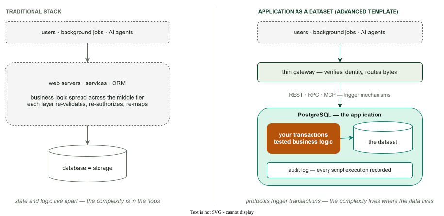
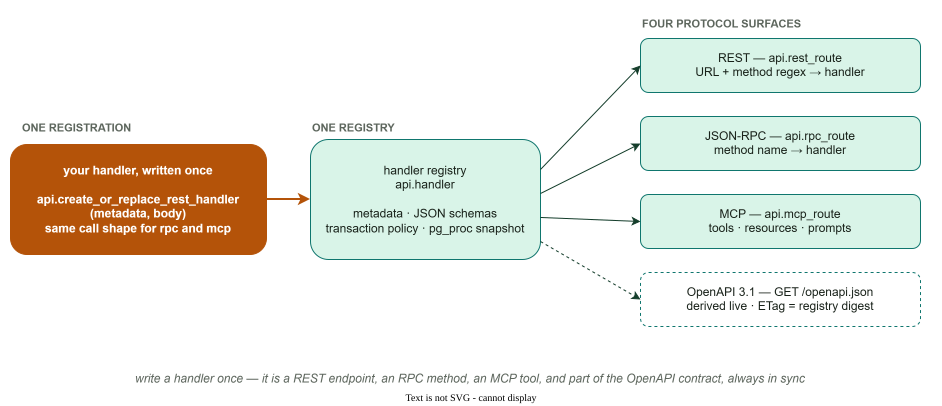
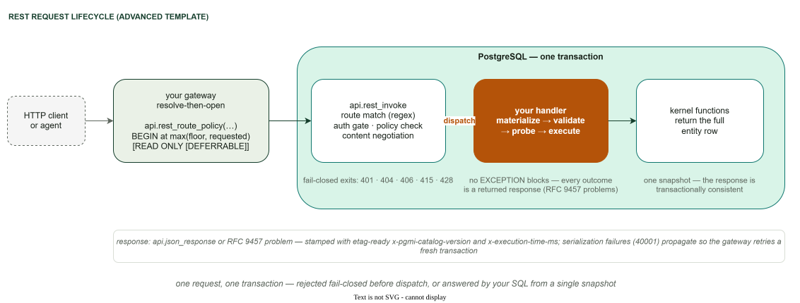
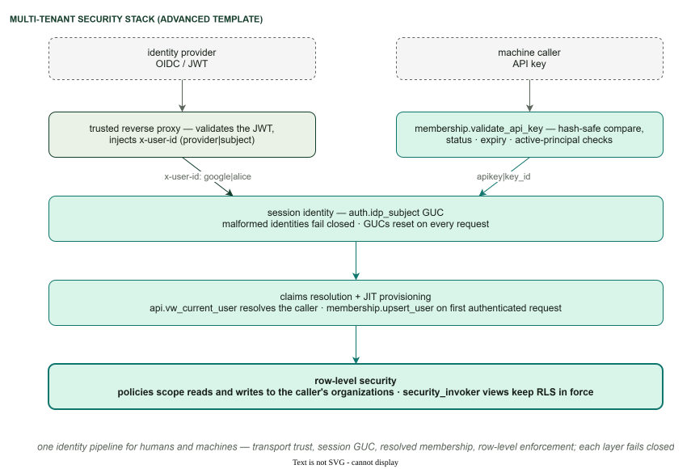
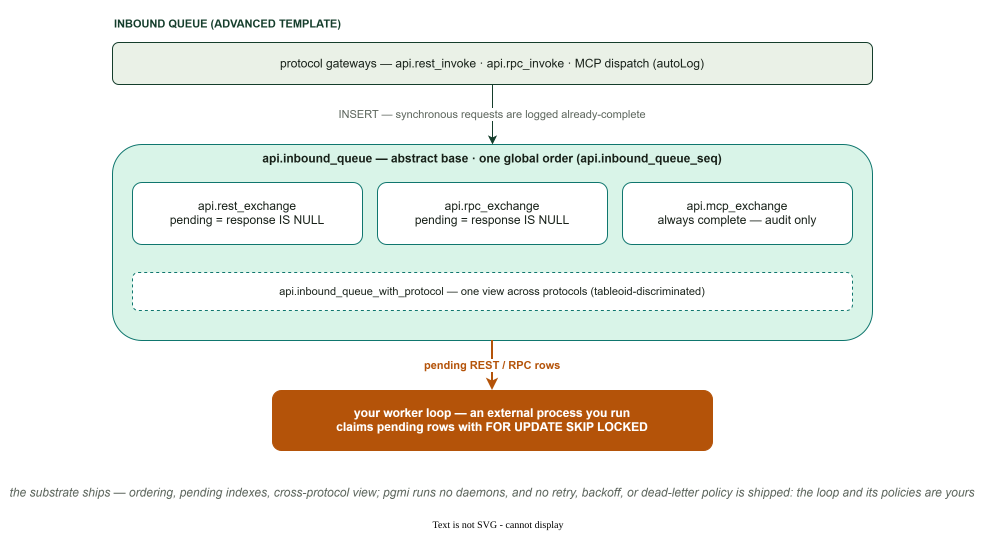

# The advanced template

pgmi ships two templates, and the boundary between them is a product boundary,
not a safety tier:

- **basic** is the starting point — a flat, explicit project you can read in
  one sitting: migrations, tests, a single-transaction `deploy.sql`.
- **advanced** is a **reference application to read and take from** — a
  complete PostgreSQL application stack scaffolded into your project. It is
  more infrastructure, not "more production-ready"; either template is
  production-capable.

Everything documented in this section is **application code you own** after
`pgmi init --template advanced`. None of it is part of pgmi core: pgmi's job
ends at preparing the session and executing your `deploy.sql`; from there the
scaffolded SQL is yours to keep, modify, or delete.

## The architecture: application as a dataset

The template embodies one architectural stance — your application *is* the
PostgreSQL database. All state lives there as a modeled dataset; external
actors modify it through well-defined, tested transactions; REST, RPC, and
MCP endpoints are trigger mechanisms for those transactions, not homes for
business logic.



The scaffolded [`ARCHITECTURE.md`](https://github.com/vvka-141/pgmi/blob/main/internal/scaffold/templates/advanced/ARCHITECTURE.md)
develops this in depth — the three-layer design (physical → virtual → API),
the transaction-first workflow, and when *not* to choose this template.

## What you get out of the box

### One handler registry, four protocol surfaces

Register a handler once — `api.create_or_replace_rest_handler` (or its
`rpc`/`mcp` sibling) — and the registry derives every surface from that single
registration: REST routing by URL regex, JSON-RPC by method name, MCP tools,
resources, and prompts for AI agents, and a live OpenAPI 3.1 document.



- The contract is **self-describing and cacheable**: `GET /openapi.json`
  serves a strong ETag derived from the registry, every response stamps
  `x-pgmi-catalog-version`, and `GET /docs` renders an interactive explorer.
  A client that preloads routes learns its contract went stale from a call it
  was already making — the caching makes client-side routing *safe*, not
  merely fast.
  [Generate typed clients](clients/_index.md) from it in any language.
- **MCP tool discovery is auth-aware**: `api.mcp_list_tools` hides
  `requires_auth` tools from an unauthenticated session, so an agent's visible
  capability set is scoped to its identity.
- Handlers follow a defensive four-phase discipline (materialize → validate →
  probe → execute) with RFC 9457 problem responses — see the scaffolded
  `api/examples.sql` for working handlers of every protocol.
- The MCP surface is a complete server implementation in SQL with a scaffolded
  HTTP transport — [its own five-page section](MCP.md) covers it.

A request travels the whole stack inside one transaction — resolved before
`BEGIN`, rejected fail-closed before dispatch, or answered by your SQL from a
single snapshot:



### Declarative per-route transaction policy

A route declares what it needs — `minTransactionIsolation` (an isolation
floor) and `readOnly` — and the client gateway resolves the policy *before*
opening the transaction: `max(floor, requested)` isolation, `READ ONLY` when
declared, `DEFERRABLE` for serializable read-only routes (which can never hit
a serialization failure and need no retries). The SQL gateways enforce the
same policy fail-closed for callers that skip the lookup, serialization
failures propagate with their SQLSTATE so clients know to retry, and OpenAPI
advertises each route's policy — including an honest `x-pgmi-replica-safe`
hint. Full reference: [Transaction policy](TRANSACTION-POLICY.md); gateway-specific details: [MCP gateway — transaction policy](MCP-GATEWAY.md#transaction-policy).

### Multi-tenant identity, RLS, and API keys

- **Membership model**: users, multi-organization membership with roles,
  invitation flow, personal organizations, and soft-delete lifecycle — all
  behind views (`vw_active_memberships`, `vw_pending_invitations`, …).
- **Trusted-gateway authentication**: identity arrives as a validated
  `provider|subject` header, lands in the `auth.idp_subject` session GUC, and
  resolves through `api.vw_current_user`; unknown users are JIT-provisioned on
  first authenticated request.
- **Row-level security** isolates tenants at the table level, enforced by
  structural tests (RLS enabled on granted membership tables,
  `security_invoker` on the view layer).
- **[API keys](API-KEYS.md)** give machines the same identity pipeline:
  hashed secrets, hash-safe comparison, SECURITY DEFINER lifecycle with
  caller authorization, and tenant-scoped management that fails closed.



### Audit trails on both planes

- **Deployment plane**: every script execution is recorded in
  `internal.deployment_script_execution_log` — UUID identity, checksum,
  timestamp, executing role — which is also what makes idempotent
  re-deployment and rename-surviving script tracking work.
- **Request plane**: protocol exchanges (REST/RPC/MCP) inherit from one
  abstract `api.inbound_queue` — the subject of the next section. Error paths
  record the SQLSTATE with truncated detail — never raw error text that could
  leak attacker-supplied input.

### The inbound queue, honestly scoped

Every protocol exchange lands in one inheritance hierarchy with a single
global order, a cross-protocol monitoring view, and pending-item partial
indexes shaped for `FOR UPDATE SKIP LOCKED` workers:



Read the caption carefully — it is the contract:

- **pgmi runs no daemons.** The synchronous gateways log requests
  already-complete; a *pending* row exists only if you enqueue work for later.
  The worker loop that claims pending rows (`FOR UPDATE SKIP LOCKED` against
  the pending indexes) is an external process **you** run — cron, systemd, a
  container, anything that can hold a PostgreSQL connection.
- **No retry, backoff, or dead-letter policy is shipped.** The tables,
  ordering, and indexes are the substrate; those policies are yours to write
  in the worker.
- **MCP exchanges are always complete** — audit rows, never work items.
- **The api role can write exchanges but not read them** — request/response
  payloads (including sanitized error detail) are ops data, readable by the
  admin role only, so a compromised api session cannot mine other requests'
  failures.

### Tested end to end

The stack ships with its own test suite — protocol dispatch, auth
enforcement, error mapping, RLS isolation, API key lifecycle, transaction
policy, membership flows — all running inside the deploy transaction with
savepoint rollback, so a failing test aborts the deployment before anything
commits. It is a working demonstration of
[pgmi's test-gated deployment model](../TESTING.md) at application scale.

## Where to start

Scaffold it and read the generated `README.md` and `ARCHITECTURE.md` — the
template documents itself:

```bash
pgmi init --template advanced myproject
```

Then pick the page that matches your intent:

| You want to | Read |
|---|---|
| Understand the architecture stance | scaffolded `ARCHITECTURE.md` |
| Expose your application to AI assistants | [MCP gateway overview](MCP.md) |
| Run and operate the scaffolded HTTP gateway | [Run the MCP gateway](MCP-GATEWAY.md) |
| Write tools, resources, and prompts | [Author MCP handlers](MCP-HANDLERS.md) |
| Authenticate machine callers | [API keys](API-KEYS.md) |
| Generate a typed client | [Client guides](clients/_index.md) |
| Version the API surface | [Design: API versioning](../design/api-versioning.md) |
