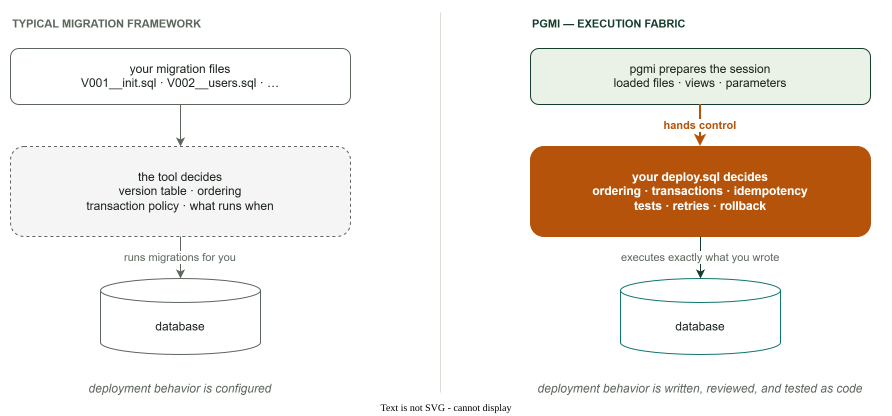

# Design Record: Why an Execution Fabric

> **Status: FOUNDATIONAL** — the product boundary. The reader-facing
> comparison lives in [Why pgmi](../WHY-PGMI.md); this page records the
> decision and its deliberate omissions.

## Decision

pgmi is an **execution fabric**: it prepares a session and executes the
project's SQL, and the project's SQL owns every deployment semantic —
selection, ordering, transactions, tests, idempotency, retry. It is not a
migration framework, where those semantics belong to the tool:

## What pgmi deliberately does not do

Each omission is a decision, not a gap — and each has a documented home on
the SQL side:

- **No version/history table.** Tracking is
  [a choice you implement](../TRADEOFFS.md#migration-tracking-is-a-choice-you-make-not-a-default-you-inherit)
  (the [advanced template](../advanced/_index.md) ships a complete one).
- **No tool-imposed execution order.** The
  [plan is a derived, queryable view](../METADATA.md#execution-order-sort-keys);
  your deploy.sql decides what to run and in which order.
- **No retry logic or error taxonomy.** Errors are
  [raw PostgreSQL errors](../TRADEOFFS.md#debugging-is-raw-postgresql-errors)
  with [numbered exit codes](../CLI.md); retry policy belongs to the layer
  that owns the transaction.
- **No implicit idempotency.** `CREATE OR REPLACE`, `IF NOT EXISTS`, and
  checksum-tracking patterns are yours to apply — pgmi will faithfully re-run
  whatever you give it.
- **No daemons, schedulers, or servers** in the deployment path. One
  invocation, one session, one exit code.

The one place pgmi's Go code reads your SQL to decide *how* to execute it —
the [first top-level transaction terminator](../DEPLOY-GUIDE.md#atomic-mode-then-psql-mode-the-execution-contract)
that splits atomic head from psql-mode tail — is deliberately a ceiling, not
a precedent: one token class, read to preserve PostgreSQL's own semantics,
never to add pgmi's.

## Rejected alternative

**The framework model itself.** A version table, `up`/`down` pairs,
tool-owned transaction boundaries, and flags for behavior were the obvious
design — every major tool in the space works that way, and users arrive
expecting it. It was rejected because the framework's model is a fixed
vocabulary: anything it didn't anticipate (test-gated commits, data-dependent
branching, [multi-phase ordering](../METADATA.md), interleaved
concurrent-index builds) becomes a feature request. Making the deployment a
PostgreSQL program makes those the user's ordinary SQL instead. The cost is
recorded, not hidden: [PL/pgSQL expertise is required](../TRADEOFFS.md#plpgsql-expertise-required),
and pgmi is [overkill for some projects](../WHY-PGMI.md#when-pgmi-is-overkill).

## The contract that makes it safe

A fabric without a stable surface would couple every project to pgmi
internals. The [versioned session API](api-versioning.md) is the counterpart
decision: internal `_pgmi_*` tables stay free to change, public
`pgmi_*_view`s are the contract —
[drawn in the session API surface diagram](../session-api.md).

## See also

- [Why session-centric](why-session-centric.md) — the mechanism underneath
- [Why no orchestration flags](why-no-orchestration-flags.md) — the policy at the CLI boundary
